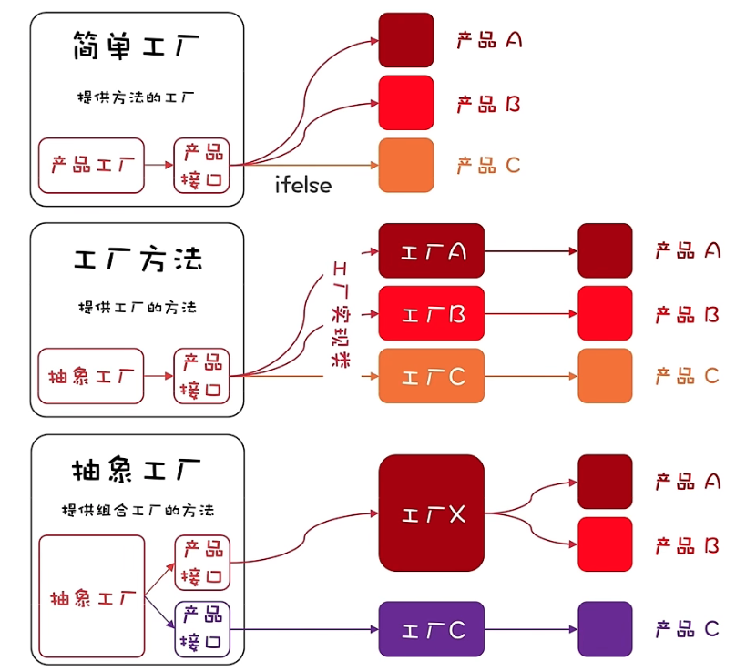

> **抽象工厂模式**：围绕一个超级工厂创建其他工厂，超级工厂是其他工厂的工厂（套娃🙄），其他工厂再生产对应的实例化对象

来自小傅哥的一张秒懂的图



下面是抽象工厂的案例，案例演示的是从蛮荒时期自建的redis服务不断迭代升级过渡的代码演变过程，在过渡的过程中，需要兼容新旧的代码，因为一些关键的业务可能仍然依赖于旧版的服务，不能立刻升级。

> 需要理解思想，不是生搬硬套，这个案例真是让我大开眼界，代码竟然还能这样写👏👏👏

[源码地址](https://github.com/FY-AhHao/learning-code/tree/main/codeDesign/demo08)

蛮荒时期redis服务

```java
//真正对外服务的缓存接口
public interface ICacheService {

    String get(String key);

    void set(String key,String value);

    void set(String key, String value, long timeout, TimeUnit timeUnit);

    void del(String key);
}

//缓存接口实现类
public class CacheServiceImpl implements ICacheService {

    private RedisUtil redisUtil = new RedisUtil();

    @Override
    public String get(String key) {
        return redisUtil.get(key);
    }

    @Override
    public void set(String key, String value) {
        redisUtil.set(key, value);
    }

    @Override
    public void set(String key, String value, long timeout, TimeUnit timeUnit) {
        redisUtil.set(key, value,timeout,timeUnit);
    }

    @Override
    public void del(String key) {
        redisUtil.del(key);
    }
}
```

经过了一段时间，公司对redis服务进行了升级，但是旧的系统无法快速过渡使用新的redis服务，因此新的redis服务需要兼容蛮荒时期的redis服务，那么我们可能会想到，在接口参数添加一个标识来识别使用哪个版本的redis服务不就可以了吗🤔？

```java
//接口增加标识
public interface ICacheService {

    String get(String key,int redisType);

    void set(String key,String value,int redisType);

    void set(String key, String value, long timeout, TimeUnit timeUnit,int redisType);

    void del(String key,int redisType);

}

//修改实现类
public class CacheClusterServiceImpl implements ICacheService {

    private RedisUtil redisUtil = new RedisUtil();

    private EGM egm = new EGM();


    @Override
    public String get(String key, int redisType) {
        if (redisType == 1){
            return egm.gain(key);
        }

        return redisUtil.get(key);
    }

    @Override
    public void set(String key, String value, int redisType) {
        if (redisType == 1){
            egm.set(key, value);
            return;
        }

        redisUtil.set(key, value);
    }

    @Override
    public void set(String key, String value, long timeout, TimeUnit timeUnit, int redisType) {
        if (redisType == 1){
            egm.setEx(key, value,timeout,timeUnit);
            return;
        }

        redisUtil.set(key, value,timeout,timeUnit);
    }

    @Override
    public void del(String key, int redisType) {
        if (redisType == 1){
            egm.delete(key);
            return;
        }

        redisUtil.del(key);
    }
}
```

但是万一以后再升级，那代码里面不是又要加一层if判断使用哪个版本的服务？更让人不能接受的是改动到了方法的参数，调用方也要跟着改，非常麻烦。有没有更加优雅的做法，可以不改动接口的情况下，以最小的代价替换服务呢？这里使用抽象工厂的思想，加上适配器和代理来实现

```java
//缓存服务适配器
public interface ICacheAdapter {

    String get(String key);

    void set(String key,String value);

    void set(String key, String value, long timeout, TimeUnit timeUnit);

    void del(String key);

}

//适配第一次升级的服务
public class EGMCacheAdapter implements ICacheAdapter {

    private EGM egm = new EGM();

    @Override
    public String get(String key) {
        return egm.gain(key);
    }

    @Override
    public void set(String key, String value) {
        egm.set(key, value);
    }

    @Override
    public void set(String key, String value, long timeout, TimeUnit timeUnit) {
        egm.setEx(key, value, timeout, timeUnit);
    }

    @Override
    public void del(String key) {
        egm.delete(key);
    }
}

//适配第二次升级的服务
public class IIRCacheAdapter implements ICacheAdapter {

    private IIR iir = new IIR();

    @Override
    public String get(String key) {
        return iir.get(key);
    }

    @Override
    public void set(String key, String value) {
        iir.set(key, value);
    }

    @Override
    public void set(String key, String value, long timeout, TimeUnit timeUnit) {
        iir.setExpire(key, value, timeout, timeUnit);
    }

    @Override
    public void del(String key) {
        iir.remove(key);
    }
}

//抽象工厂
public class JDKProxyFactory {
  
    //理解为超级工厂生产ICacheService工厂，ICacheService工厂生产ICacheAdapter实例化对象
    public static <T> T getProxy(Class<T> clazz, Class<? extends ICacheAdapter> cacheAdapter) throws Exception {
        JDKInvocationHandler invocationHandler = new JDKInvocationHandler(cacheAdapter.newInstance());
        ClassLoader contextClassLoader = Thread.currentThread().getContextClassLoader();
        return (T) Proxy.newProxyInstance(contextClassLoader,new Class[]{clazz},invocationHandler);
    }

}


public class JDKInvocationHandler implements InvocationHandler {

    private ICacheAdapter cacheAdapter;

    public JDKInvocationHandler(ICacheAdapter cacheAdapter) {
        this.cacheAdapter = cacheAdapter;
    }

    @Override
    public Object invoke(Object proxy, Method method, Object[] args) throws Throwable {
        return ICacheAdapter.class.getMethod(method.getName(),method.getParameterTypes()).invoke(cacheAdapter,args);
    }
}
```

经过抽象工厂模式改造以后，调用方只需获取自己需要的服务实例化对象即可(使用spirng框架后，只需要往容器中注入相应的对象即可)，因为接口没有做改动，无需修改其他业务代码。

```java
public class ApiTest {

    public static void main(String[] args) throws Exception {
        ICacheService cacheService = new CacheServiceImpl();
        cacheService.set("hello","origin cache service");
        cacheService.get("hello");

        ICacheService egm = JDKProxyFactory.getProxy(ICacheService.class, EGMCacheAdapter.class);
        egm.set("hello","egm service");
        egm.get("hello");

        ICacheService iir = JDKProxyFactory.getProxy(ICacheService.class, IIRCacheAdapter.class);
        iir.set("hello","iir service");
        iir.get("hello");
    }
}
```

